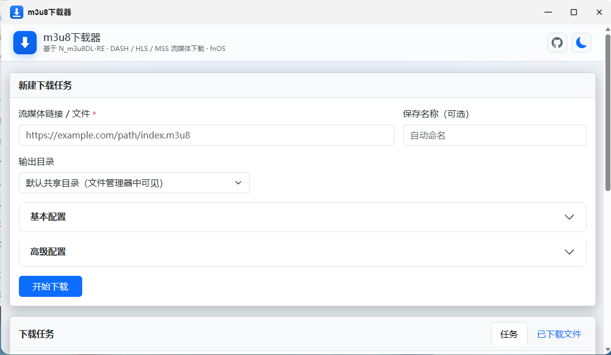

# m3u8下载器（N_m3u8DL-RE for fnOS）

把开源项目 [N_m3u8DL-RE](https://github.com/nilaoda/N_m3u8DL-RE)（跨平台 DASH/HLS/MSS 下载工具，MIT License）
封装为飞牛 fnOS 可安装的 `.fpk` 第三方应用，带**可视化 Web 界面**和**完整的命令行参数配置**。

- **开发者**：Youngxj（<https://github.com/Youngxj>）
- **项目主页**：<https://github.com/Youngxj/N_m3u8DL-RE-FN>
- **引擎**：[nilaoda/N_m3u8DL-RE](https://github.com/nilaoda/N_m3u8DL-RE)



## 功能亮点

- **Web 管理界面**（飞牛原生 index.cgi）：应用卡片打开即用，任务提交、**实时进度**（速度/已下载/总量/分片/剩余时间/流类型）、文件管理
- **全部参数可视化**：N_m3u8DL-RE 完整命令行参数接入界面，分「基本配置 / 高级配置」两组中文表单
- **实时性**：PTY 运行引擎逐帧落盘，多端进度一致；按真实输出格式解析（`MBps`、`581.06MB/1.68GB`、`00:00:46`、`Vid` 等）
- **文件列表只列程序产出**：任务前后目录快照对比，不扫描目录、不显示无关文件
- **fnOS 文件选择器**：输出目录可用系统文件管理器浏览选择（需 fnOS 1.2.0401+）
- **应用与引擎更新**：Web 界面检查应用（本项目 Releases）与核心引擎（上游 N_m3u8DL-RE Releases）新版本；**应用内一键升级核心引擎**（下载→校验→原子替换，不影响已有任务）；应用有新版本时一键下载 fpk 到共享目录供应用中心手动安装；网络不可达时优雅降级仅显示本地版本
- **双架构单包**（x86_64 / aarch64）、CLI 同时可用（`/usr/local/bin/N_m3u8DL-RE`）

## 目录

```text
├── m3u8_down/          # fpk 应用包源码（app/ 打包为 app.tgz）
│   ├── manifest          # 应用元数据（含 checksum、micro_app、入口）
│   ├── config/           # privilege / resource（data-share + usr-local-linker + api-scope）
│   ├── cmd/              # 生命周期脚本
│   ├── ui/               # 桌面入口配置 + 图标 → fpk 顶层
│   ├── app/              # 负载：bin(双架构+wrapper+task-run) / ui/index.cgi / www(前端+SDK)
│   └── README.md / USAGE.md / LICENSE
├── test/                 # 本地 CGI 集成测试（git-bash，36 项断言）
├── build-fpk.mjs         # 跨平台构建脚本（版本自动递增 .N）
├── dist/                 # 构建产物（git 忽略）
├── .cache/               # 下载缓存 / 构建计数（git 忽略）
└── fnnas-docs/           # 飞牛开发者文档镜像
```

## 构建

```bash
node build-fpk.mjs                          # 最新 Release，版本自动递增（0.6.0-beta.N）
node build-fpk.mjs --version v0.6.0-beta --build 5 --note "说明"
# 正式发布可用官方 fnpack：fnpack build --directory m3u8_down
```

## 安装

应用中心 → 手动安装 `dist/m3u8_down_<版本>_all.fpk` → 打开「m3u8下载器」卡片。
SSH 命令行：`N_m3u8DL-RE "https://..." --save-dir /vol1/...`。

## 免责声明

仅用于学习与技术研究，请只下载拥有合法权限的流媒体内容。
